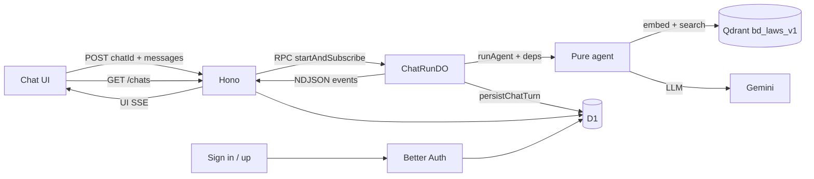

# Zenith

> **Work in progress.** APIs, UI, auth, and persistence are under active development. Expect breaking changes.

**Zenith** is a legal AI chat assistant focused on **Bangladesh law** — acts, sections, and grounded answers with citations. It runs as a modern full-stack app on **Cloudflare Workers**: streaming chat in the browser, a pure multi-step RAG agent on the server, Durable Objects for run ownership, and D1 for conversation history.

Ask a question → the agent routes, plans retrieval, searches a Qdrant corpus (`bd_laws_v1`), judges sufficiency, then streams a cited answer back to the UI.

---

## What it does

- **Conversational legal Q&A** with Grok-style step progress (“routing”, “retrieving”, “synthesizing”…)
- **Hybrid grounding** — retrieved statute passages as anchors, plus model synthesis for totals / comparisons / follow-ups
- **Inline citations** in answers (e.g. act title, year, section)
- **Streaming UI** via the AI SDK (`useChat`) with stop/cancel of in-flight runs
- **Anonymous chat history** in D1 (sidebar + `/chat/$id`); Better Auth sign-in/up is wired for accounts (claim / cross-device history still evolving)
- **Draft-first chat** — a conversation id is only created when you send the first message

---

## Stack

| Layer | Choice |
|--------|--------|
| UI | React 19, TanStack Start / Router, Tailwind, Motion, Streamdown |
| API | Hono on `/api/rest/*` |
| Auth | Better Auth (email + username/password) on `/api/auth/*` |
| Inference | Google Gemini (AI SDK) + Qdrant vector search |
| Runtime | Cloudflare Workers, Durable Objects (SQLite), D1 |
| Agent | Pure TypeScript in `src/agent` (no Hono/DO imports in the loop) |

---

## Architecture

```text
Browser (useChat)
  → Hono  POST /api/rest/chat
  → ChatRunDO  (one DO ≈ one assistant turn / runId)
  → runAgent   route → plan → retrieve → judge* → cite → answer
  → AgentEvent NDJSON → UI SSE (AI SDK)
  → D1         persist turn (chats / messages / citations)
```



### Important IDs

| ID | Meaning |
|----|---------|
| `chatId` | Conversation thread (URL `/chat/$chatId`, D1 `chats.id`) |
| `runId` | One assistant turn (Durable Object name, `messages.run_id`) |

Disconnecting the HTTP stream does **not** cancel the agent. Explicit cancel calls `DELETE /api/rest/chat/runs/:runId`, which aborts the DO-owned run.

### Layout (high level)

```text
src/
  agent/            # Pure RAG agent (ports, prompts, Qdrant, Gemini)
  durable-objects/  # ChatRunDO — event log, fan-out, cancel, persist
  hono/             # REST: chat stream, history, health
  features/chat/    # Chat shell, sidebar, composer, useZenithChat
  db/               # Drizzle schema (app + Better Auth)
  lib/auth*.ts      # Better Auth server + client
  routes/           # TanStack pages: /, /chat/$id, /sign-in, /sign-up
  server.ts         # Worker entry: auth → Hono → Start
migrations/         # D1 SQL migrations
```

More detail: [`src/agent/README.md`](src/agent/README.md), [`src/durable-objects/README.md`](src/durable-objects/README.md).

---

## Status / roadmap snapshot

**In place**

- Multi-step legal RAG agent + streaming chat UI
- DO-backed runs with cancel
- D1 chat history (anonymous ownership via `localStorage` ids)
- Better Auth + minimal sign-in / sign-up pages
- Page titles + Zenith favicon

**Still WIP / next**

- Account-scoped history list + claim anonymous chats on login
- Production D1 `database_id` (replace local placeholder)
- Richer message persistence (reasoning / steps optional)
- Auth hardening and product polish

---

## Getting started

### Prerequisites

- Node.js 22+ and [pnpm](https://pnpm.io)
- Gemini API key
- Qdrant collection with Bangladesh law embeddings (default name `bd_laws_v1`, **768-dim**)

### Install & env

```bash
pnpm install
cp .dev.vars.example .dev.vars
```

Edit **`.dev.vars`** (Cloudflare Worker bindings — **not** only `.env.local`):

```bash
GEMINI_API_KEY=...
QDRANT_URL=...
QDRANT_API_KEY=...
QDRANT_COLLECTION=bd_laws_v1
BETTER_AUTH_SECRET=...   # pnpm dlx auth@latest secret
```

`BETTER_AUTH_URL` defaults to `http://localhost:3000` in `wrangler.jsonc`.

### Database (local D1)

```bash
pnpm db:d1:local    # apply migrations under ./migrations
pnpm cf-typegen     # refresh Env types after wrangler changes
```

### Dev server

```bash
pnpm dev            # http://localhost:3000
```

### Useful scripts

| Script | Purpose |
|--------|---------|
| `pnpm dev` | Local Workers + Vite |
| `pnpm build` / `pnpm deploy` | Production build / Wrangler deploy |
| `pnpm db:d1:local` | Apply D1 migrations locally |
| `pnpm auth:generate` | Regenerate Better Auth Drizzle schema → `src/db/auth-schema.ts` |
| `pnpm check` | Biome lint + format check |

---

## Configuration notes

- **Worker secrets** live in `.dev.vars` for local; use `wrangler secret put …` in production.
- **Embedding dims** and collection defaults are in [`src/agent/config.ts`](src/agent/config.ts) — keep them aligned with your Qdrant index.
- For a **remote** D1 database, create one with Wrangler, set `database_id` in `wrangler.jsonc`, then apply migrations without `--local`.

---

## License

Private / unpublished unless otherwise stated. All rights reserved while the project remains in early development.
